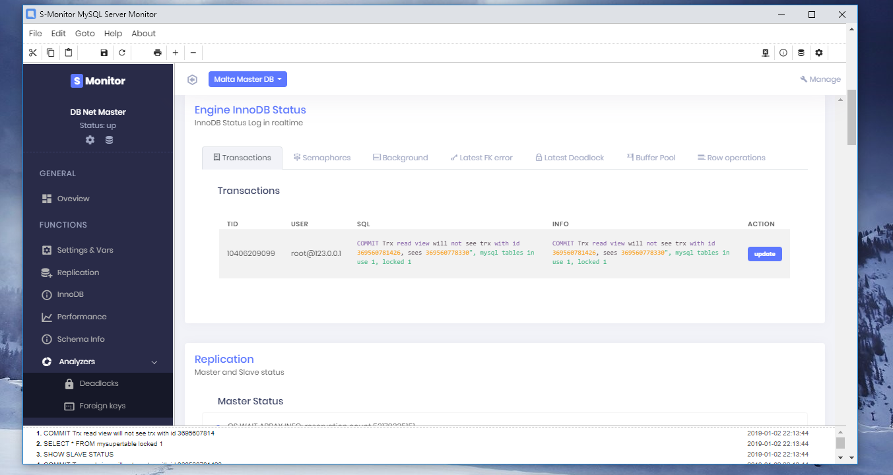

## S - DBA


**Desktop MySQL DBA Monitor**

Electron-like MySQL Monitor including popular metrics based on `Information Schema`, `Performance Schema` 
`MySQL Monitor Logs` and `Status logs`. 

Program is written in Python, GUI is based on Program uses [EEL Library](https://github.com/ChrisKnott/Eela)



---
## Key Features

1. Overview - general database overview
	- active processes
	- key hit rates
	- cache hit rates
	- buffer efficiency and utilization
	- connections info (max connections, connection errors)
	- info about logs (settings, file names and locations)
	- general commands statistics 
	- some other info and stats
   
2. Settings & Variables - general info about all DB settings splitted per session and global scopes
	- system settings & properties
	- session settings & properties

3. Replication - info about replication
	- Master and Slave status 
	- the most important replication values 
	- relay and binlog info
	- relay and master logs file and position
	- latest I/O and SQL errors
	- replication delay 
	- other info

4. InnoDB Monitor - status of InnoDb engine
    - latest transactions
    - semaphores
    - background thread info
    - row operations
    - latest foreign key error
    - latest found deadlock
    - buffer pool info

5. Performance - info about performance
	- top 10 the longest SELECT queries (query, percent of all queries, last occurence date)
	- top 10 the longest UPDATE queries (query, percent of all queries, last occurence date)
	- indexes stats for top 10 the biggest tables

6. Info Schema - info about databases and tables
	- info about the biggest tables
	- DB size splitted per engines
	- the biggest tables without Primary Key
 
7. Analyzers
	+ Deadlock Analyzer
		- tool analyzes provided deadlock log from MySQL Error Log
	+ Foreigh Key Error Analyzer
		- tool analyzes provided foreign key error log from MySQL Error Log

  

## Functionality vs needed permissions

1. Overview

| Priviledge | Context | Performed actions | Info |
| :---         |     :---:      |         :---: | :---: |
| [ [ PROCESS ] ](https://dev.mysql.com/doc/refman/8.0/en/privileges-provided.html#priv_process)   | Server administration     | SELECT/READ ONLY    | **[NL]
| [ [ SELECT ] ](https://dev.mysql.com/doc/refman/8.0/en/privileges-provided.html#priv_select)  + DB [ [ information_schema ] ](https://dev.mysql.com/doc/refman/8.0/en/information-schema.html) access | Tables or columns     | SELECT/READ ONLY    | **[NL]

**[NL] - Not mandatory. Limitted functionality if priviledge not granted.

2. Replication

| Priviledge | Context | Performed actions | Info |
| :---         |     :---:      |         :---: | :---: |
| [ [ SUPER ] ](https://dev.mysql.com/doc/refman/8.0/en/privileges-provided.html#priv_super) or [ [ REPLICATION CLIENT ] ](https://dev.mysql.com/doc/refman/8.0/en/privileges-provided.html#priv_replication-client)  | Server administration     | SHOW STATUS   | **[M]

**[M] - mandatory. Disabled functionality if priviledge not granted.


3. Settings & Variables

| Priviledge | Context | Performed actions | Info |
| :---         |     :---:      |         :---: | :---: |
| Any - does not require any special rights | Any     | SHOW VARIABLES   | -

**[M] - mandatory. Disabled functionality if priviledge not granted.


4. InnoDB

| Priviledge | Context | Performed actions | Info |
| :---         |     :---:      |         :---: | :---: |
| [ [ PROCESS ] ](https://dev.mysql.com/doc/refman/8.0/en/privileges-provided.html#priv_process) | Server administration     | SHOW STATUS   | **[M]

**[M] - mandatory. Disabled functionality if priviledge not granted.


5. Performance 

| Priviledge | Context | Performed actions | Info |
| :---         |     :---:      |         :---: | :---: |
| [ [ SELECT ] ](https://dev.mysql.com/doc/refman/8.0/en/privileges-provided.html#priv_select) + DB [ [ performance_schema ] ](https://dev.mysql.com/doc/refman/8.0/en/performance-schema-startup-configuration.html) access + DB [ [ Performance Schema ] ](https://dev.mysql.com/doc/refman/8.0/en/performance-schema-startup-configuration.html) ENABLED | Server administration     | SELECT/READ   | **[M]
| Performance Schema ENABLED - setting [mysqld] performance_schema=ON | Server administration     | SELECT/READ   | **[M]

**[M] - mandatory. Disabled functionality if priviledge not granted.


6. Performance 

| Priviledge | Context | Performed actions | Info |
| :---         |     :---:      |         :---: | :---: |
| [ [ SELECT ] ](https://dev.mysql.com/doc/refman/8.0/en/privileges-provided.html#priv_select) + DB [ [ performance_schema ] ](https://dev.mysql.com/doc/refman/8.0/en/performance-schema-startup-configuration.html) access + DB [ [ Performance Schema ] ](https://dev.mysql.com/doc/refman/8.0/en/performance-schema-startup-configuration.html) ENABLED | Server administration     | SELECT/READ   | **[M]
| Performance Schema ENABLED - setting [mysqld] performance_schema=ON | Server administration     | SELECT/READ   | **[M]

**[M] - mandatory. Disabled functionality if priviledge not granted.


7. Schema Info
| Priviledge | Context | Performed actions | Info |
| :---         |     :---:      |         :---: | :---: |
| [ [ SELECT ] ](https://dev.mysql.com/doc/refman/8.0/en/privileges-provided.html#priv_select)  + DB [ [ information_schema ] ](https://dev.mysql.com/doc/refman/8.0/en/information-schema.html) access | Tables or columns     | SELECT/READ ONLY    | **[M]

**[M] - mandatory. Disabled functionality if priviledge not granted.


8. Analyzers
| Priviledge | Context | Performed actions | Info |
| :---         |     :---:      |         :---: | :---: |
| No any special rights needed | Any    | No SQL, only static log analyze  | **[M]

**[M] - mandatory. Disabled functionality if priviledge not granted.


## Queries and Metrics
#### Used MySQL queries

Some examples of MySQL queries the program uses for obtaining data from DB.


##### Getting the biggest tables
```mysql
SELECT
    table_name AS `Table`,
    table_schema AS `Database`,
    round(((data_length + index_length) / 1024 / 1024 / 1024), 2) `size_in_gb`
FROM
    information_schema.TABLES
ORDER BY
    seze_in_gb DESC
LIMIT 10;
```


##### Getting the biggest tables incl. indexes
```mysql
SELECT
    ENGINE,
    COUNT(*) AS count_tables,
    SUM(DATA_LENGTH+INDEX_LENGTH) AS SIZE,
    SUM(INDEX_LENGTH) AS index_size
FROM
    information_schema.TABLES
WHERE
    TABLE_SCHEMA NOT IN ('mysql','INFORMATION_SCHEMA','PERFORMANCE_SCHEMA')
    AND ENGINE IS NOT NULL
GROUP BY ENGINE
LIMIT 10;
```

##### Getting tables without Primary Key
```mysql
SELECT
    t.TABLE_SCHEMA,
    t.TABLE_NAME,
    t.TABLE_ROWS
FROM
    information_schema.TABLES t
LEFT JOIN
    information_schema.TABLE_CONSTRAINTS tc
ON
    t.table_schema = tc.table_schema
    AND t.table_name = tc.table_name
    AND tc.constraint_type = 'PRIMARY KEY'
WHERE
    tc.constraint_name IS NULL AND t.table_type = 'BASE TABLE'
ORDER BY
    TABLE_ROWS DESC
LIMIT 10;
```

##### Getting DB size splitted per engine type
```mysql
SELECT
    ENGINE,
    COUNT(*) AS count_tables,
    SUM(DATA_LENGTH+INDEX_LENGTH) AS SIZE,
    SUM(INDEX_LENGTH) AS index_size
FROM
    INFORMATION_SCHEMA.TABLES
WHERE
    TABLE_SCHEMA NOT IN ('mysql','INFORMATION_SCHEMA','PERFORMANCE_SCHEMA')
    AND ENGINE IS NOT NULL
GROUP BY
    ENGINE
LIMIT 10;

```

##### Getting Active Processes
```mysql
SELECT
    *
FROM
    information_schema.PROCESSLIST
WHERE
    COMMAND != "Sleep";

```


##### Getting top long SELECT queries
```mysql
SELECT
    digest_text,
    last_seen,
    count_star,
    TRUNCATE(avg_timer_wait/1000000000000, 6) AS avg_timer_wait
FROM
    performance_schema.events_statements_summary_by_digest
WHERE
    LAST_SEEN >= CURRENT_DATE() - INTERVAL 3 DAY
ORDER BY
    avg_timer_wait DESC
LIMIT 10;
```

##### Getting top long UPDATE queries
```mysql
SELECT
    digest_text,
    count_star / update_total * 100 AS percentage_of_all_updates,
    last_seen
FROM
    performance_schema.events_statements_summary_by_digest,
    (
        SELECT
            SUM(count_star) update_total
        FROM
            performance_schema.events_statements_summary_by_digest
        WHERE
            digest_text LIKE 'UPDATE%'
            AND LAST_SEEN >= CURRENT_DATE() - INTERVAL %s DAY
    ) update_totals

    WHERE
        digest_text LIKE 'UPDATE%' AND LAST_SEEN >= CURRENT_DATE() - INTERVAL %s DAY
    ORDER BY
        percentage_of_all_updates DESC
    LIMIT 10;
```


##### Getting index stats for the biggest tables
```mysql
SELECT
    obecjt_schema AS table_schema,
    object_name AS TABLE_NAME,
    index_name,
    count_fetch
FROM
    performance_schema.table_io_waits_summary_by_index_usage
WHERE
    `object_schema` IN('test_database','test')
    AND `object_name` IN('table1', 'table2','table3')
GROUP BY
    object_schema,
    object_name,
    index_name
ORDER BY
    object_schema,
    object_name;
```

##### Getting variables
```mysql
-- show session variables
SHOW SESSION VARIABLES;

-- show global variables
SHOW GLOBAL VARIABLES;
```

##### Getting replication status
```mysql
-- master status
SHOW MASTER STATUS;

-- slave status
SHOW SLAVE STATUS;
```

##### Getting DB statuses
```mysql
-- InnoDD Status Log
SHOW ENGINE INNODB STATUS;

-- Global Status
SHOW GLOBAL STATUS;

-- Max connections
SELECT @@max_connections;
```


#### Metrics calculation

##### Buffer pool efficiency
```matlab
(1 - ["Innodb_buffer_pool_reads"] / ["Innodb_buffer_pool_read_requests"]) * 100
```

##### Buffer pool utiization
```matlab
[(Innodb_buffer_pool_pages_total - Innodb_buffer_pool_pages_free) / Innodb_buffer_pool_pages_total ] * 100
```

##### Key Read Efficiency
```matlab
round(1 - ["Key_reads"] / ["Key_read_requests"], 2) * 100)
```

##### Key Write Efficiency
```matlab
round(1 - ["Key_writes"] / ["Key_write_requests"], 2) * 100)
```

##### Query cache hit rate
```matlab
round(["Qcache_hits"] / (["Qcache_hits"] + ["Com_select"]), 2) * 100
```


## Authors

* **Slawomir Hadas** - *author* - [Github](https://github.com/hadasbro)

## Acknowledgments
+ [Eel](https://github.com/ChrisKnott/Eel) Electron-like offline HTML/JS GUI apps
+ [Percona](https://www.percona.com/) Community & Forum
+ [MySQL](https://dev.mysql.com) Community

---
